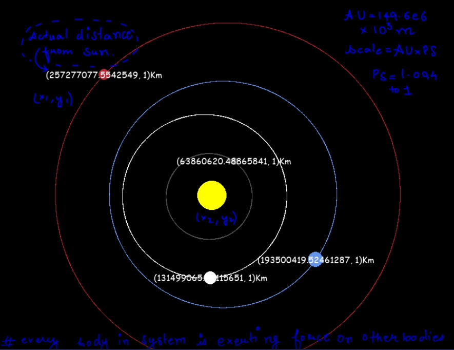
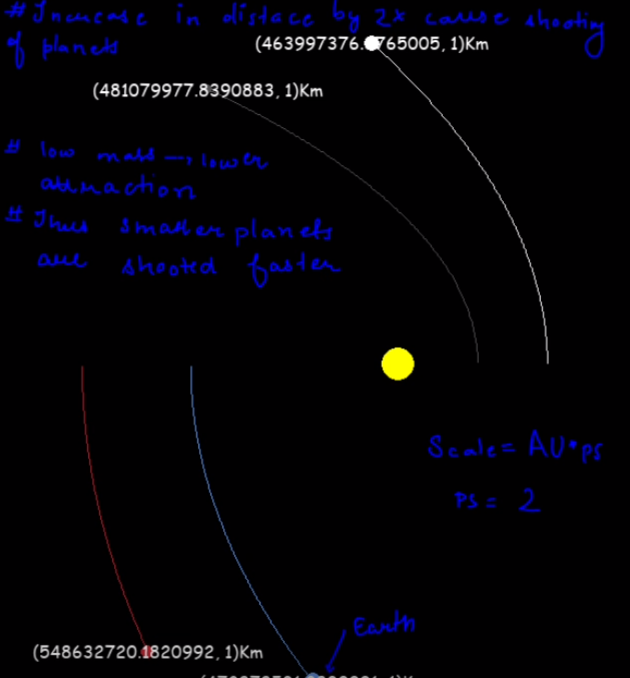
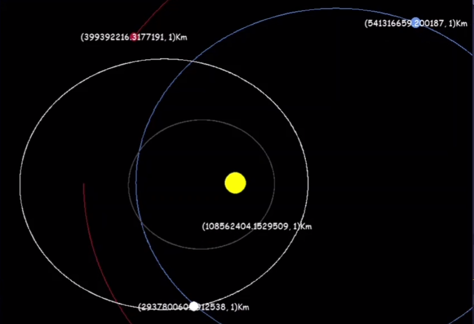

# GAGAN GYANI

Creating a simulation of the first four planets in the solar system (Mercury, Venus, Earth, and Mars) with accurate physics using pygame can be an exciting project! 🌌 Here's an outline of the steps to build such a simulation:

**Set up the environment:**

1. Install pygame: Make sure you have pygame installed on your system. You can install it using pip: `pip install pygame`. 🕹️🛠️
2. Define constants:

   Gather the necessary data for each planet, such as their mass, radius, initial position, and velocity. Set up constants like gravitational constant (G) and time step (dt) for the simulation. 📊⏳

**Create the Planet class:**

3. Create a class to represent each planet with attributes like mass, radius, position, velocity, and color. 🪐📏🌍🌕🪂
4. Implement a method to update the planet's position and velocity based on gravitational forces from other planets. 🚀🌠

**Implement the main simulation loop:**

5. Initialize pygame and set up the screen. 🖥️🎮
6. Create instances of the Planet class for each planet. 🪐🪐🪐🪐

**Inside the main loop:**

7. Calculate the gravitational forces acting on each planet from the other planets and update their positions and velocities accordingly. 🌌📈
8. Draw the planets on the screen at their updated positions. 🎨🪐

**Implement accurate physics:**

9. Use Newton's law of universal gravitation to calculate the force between each pair of planets. 🌌🔍
10. Use numerical integration methods like Euler's method or Verlet integration to update the positions and velocities of the planets. 🧮📊

With these steps and a dash of creativity, you'll be well on your way to creating a captivating planetary simulation using pygame! 🚀🪐🌠🎮🌌
# perfect value for AU distance scale multiplication is 1.094 
# as taking same disa tnce as of the AU could not allow vissible elliptical axis 

USING PYTHAGOREAN THEOREM ----- for calculating distance betweem bodies-------
gives arc tangent of y/x // both's signs are considered

#--------------- velocity in m/s -----------------
# ...........(-,+) decide direction...............
# made px(pixel scale) scale of absrtact visual reperesentation inversely proprtional to AU' s scale

